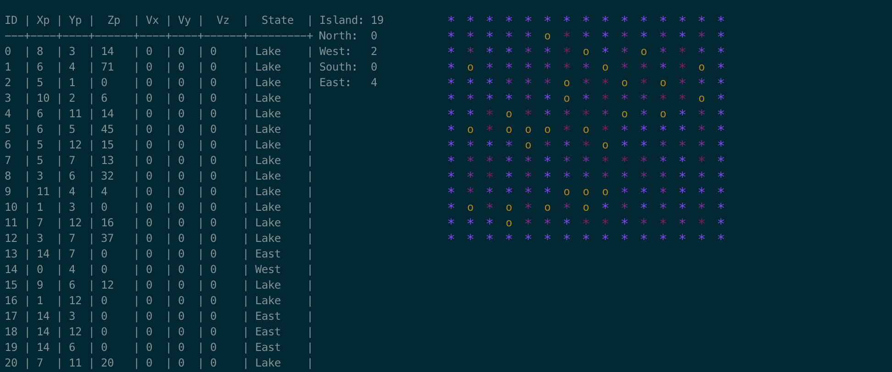
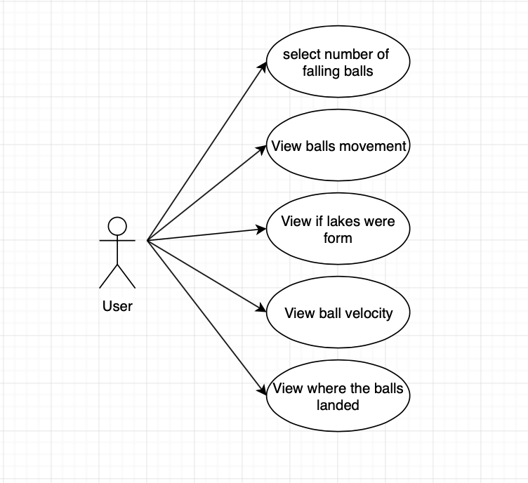
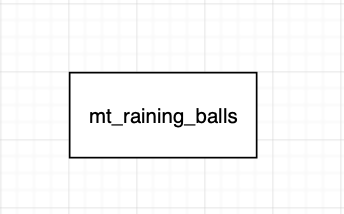
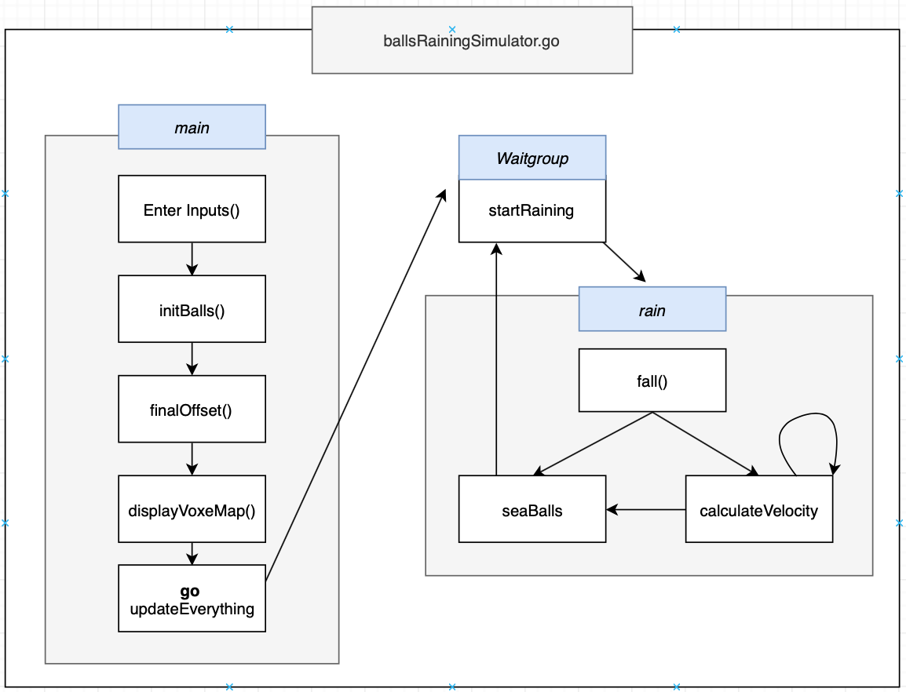
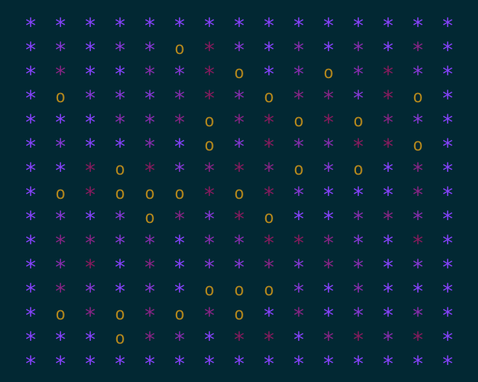
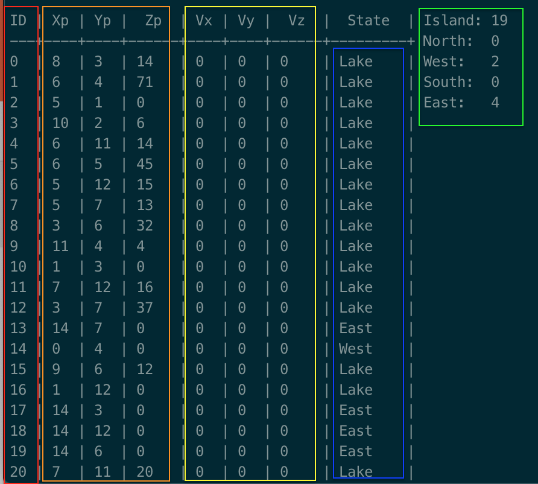

# Multithreaded Raining Balls Island Simulator

## Authors
- **A00959979** Humberto Atondo Martin del Campo 
- **A01227157** Kevin Oswaldo Cabrera Navarro 
- **A01264241** Giliberto Rogel García 

## Use Case
The program is very simple according to what the user can do. It is more focused in processing and displaying information.


1. **Select number of falling balls** Number of balls in the raining is defined in the simulation's start. Balls' movement will be based on the heights arround it.
2. **View balls movement** user can track each ball's behaviour which are implemented in a separated thread.
3. **View if lakes were formed**
4. **View ball velocity** Each ball will increase its speed when it goes to a lower height
5. **View where the balls landed** Display the number of balls that are in sea north, south, east and west sides. And also, display how many balls were trapped in the island.

## Architecture


The running program is really simple. It is composed from only one class. Everything is handled in here. Inputs/outputs, processing, and anything related is the *ballsRainingSimilation* program. No extra agents or master components are needed. 

## Multithreading
The ``startRain()`` function is the key of the multithreading in the program. It first create the goroutines, then the wg (waitgroup) variable is in charge of waiting for all the goroutines to be completed to finish the program.

````
func startRain() {
	var wg sync.WaitGroup
	k := 0
	for i := 0; i < iterations; i++ {
		for j := 0; j < numBalls; j++ {
			wg.Add(1)
			go rain(k, &wg)
			k++
		}
		time.Sleep(time.Second * 3)
	}
	wg.Wait()
	updateScreen()
}
````

Each time a gouroutine is started the function `wg.Add() ` makes the value of the waitgroup bigger.

When the function rain is done, then `wg.Done()` is called and the value of the waigroup goes lower.

When the waitgroup is 0, the `wg.Wait()` will be completed and will allow to finish that part of the program

## Processes View

this is a general idea of how the programs operates.
* **enterInputs()**: the user enters the Island size and number of balls from the terminal
* **initBall()**: the program will initiate the balls according to the output
* **finalOffset()**: set the decorative terminal outputs
* **displayVoxeMap()**: draws the map with the info.
* **updateEverything()**: goroutine that will be in charge of the independent ball movement.
* **startRaining()**: waitgroup that synchronizes the routines.
* **fall()**: simulates the ball falling to the island
* **calculateVelocity()**: if the ball hasn't arrive to some kind of water/sea/lake it will continue
* **seaBalls()**: once it arrives to its destination it tells the waitgroup that is finished.


## Requirements


- **Create an island:** the island's map can be static or automatically generated. The island map shares resources across all balls threads. The purple asterisks represent hills, while the yellow circles simbolizes balls.
- **Create falling ball multithread:** Each ball's behaviour must be implemented in a separated thread. Number of balls in the raining is defined in the simulation's start. If 2 balls collide, they will randomly change their direction, no matter if the new position is higher.
- **Create falling ball:** Randomly falling on different positions of the island. Balls' movement will be based on the heights arround it. Balls will move either north, south, east or west.
- **Balls display:** Display total of balls that are currently in the sea. Also shows how many balls were trapped in the island.
- **Detect lake formation:** Implement an Artificial Intelleigence algorithm for detecting lakes formation.



*red represent ball id, orange their position in the island, yellow their velocity, purple if their location and green the total values of the program*

To quit the program you need to kill it with the `ctrl + C` command